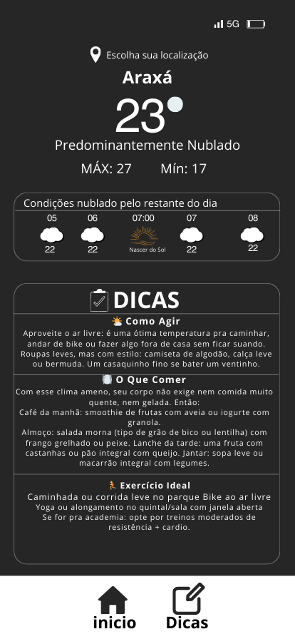
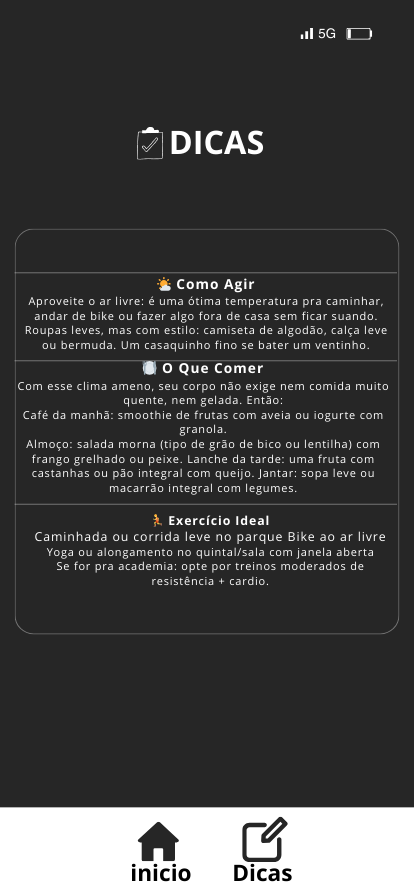

# 🌤️ Clima com Dicas

Um aplicativo mobile desenvolvido com **React Native via Expo Go** que exibe a previsão do tempo em tempo real utilizando a **API do OpenWeatherMap**. Além disso, o app oferece **dicas personalizadas** do que fazer, comer e como se vestir com base na temperatura do dia.

---

## 📱 Telas do Aplicativo

### Tela de Clima

### Tela de Dicas

---

## 🛠️ Tecnologias Utilizadas

- **React Native** com [Expo Go]
- **API OpenWeatherMap** (https://openweathermap.org/api)
--
## 🚀 Funcionalidades

- Busca da previsão do tempo em tempo real por localização
- Exibição de:
  - Temperatura atual
  - Condições climáticas (nublado, chuvoso, etc.)
  - Ícones representativos do clima
- Dicas baseadas na temperatura:
  - O que comer
  - Que roupa vestir
  - Atividades ideais para o dia

---

## 🧪 Em breve

- Escolha de cidade manual
- Notificações diárias com previsão + dica
- Tema claro/escuro automático

